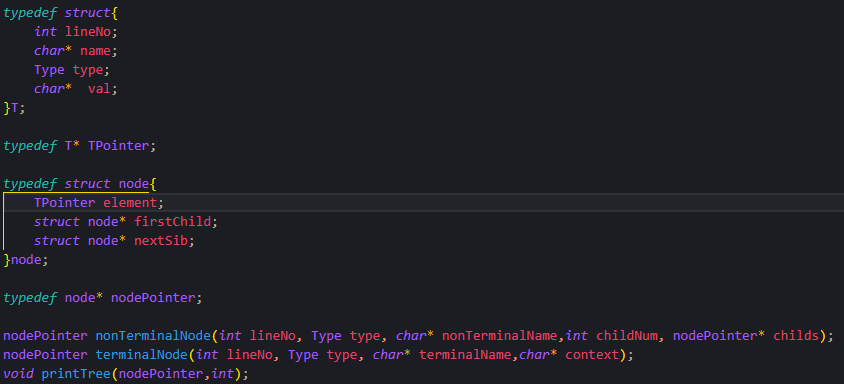

&nbsp;
&nbsp;
&nbsp;
&nbsp;
<center> <font size = 6> 哈尔滨工业大学计算学部 </font></center>
&nbsp;
&nbsp;
&nbsp;
&nbsp;

<center> <font size = 12> 实验报告 </font></center>

&nbsp;
&nbsp;

<center><font size = 5> 
课程名称：编&nbsp;&nbsp;&nbsp;&nbsp;&nbsp;&nbsp;译&nbsp;&nbsp;&nbsp;&nbsp;&nbsp;&nbsp;原&nbsp;&nbsp;&nbsp;&nbsp;&nbsp;&nbsp;理

课程类型：&nbsp;&nbsp;&nbsp;&nbsp;&nbsp;&nbsp;限&nbsp;&nbsp;&nbsp;&nbsp;&nbsp;&nbsp;&nbsp;&nbsp;&nbsp;&nbsp;&nbsp;&nbsp;&nbsp;选&nbsp;&nbsp;&nbsp;&nbsp;&nbsp;&nbsp;
实验题目：语&nbsp;&nbsp;&nbsp;&nbsp;&nbsp;&nbsp;法&nbsp;&nbsp;&nbsp;&nbsp;&nbsp;&nbsp;分&nbsp;&nbsp;&nbsp;&nbsp;&nbsp;&nbsp;析
</font> </center>

<center> <font size = 5> 学号：1190201019 </font></center>
<center> <font size = 5> 姓名：罗家乐 </font></center>

<div STYLE="page-break-after: always;"></div>

# 一、 功能及实现

为完成实验一必做部分要求，共实现了：基于Flex与Bison的语法分析、语法树构建以及词法/语法错误提示三个部分的功能。

## 基于Flex与Bison的语法分析

参照实验指导手册与Flex/Bison官方手册，在Flex中编写相关正则定义、匹配后的ACTION（配合bison.h文件中的终结符定义），实现yylex函数将文件解析成token流的功能。

在Bison中则参照指导书与其余资料，编写token定义、生成式、计算优先级，以及main函数，最终生成能够解析文件的语法分析器。

至此，成功实现C--代码的语法分析。

## 语法树构建

对于正确的C--代码，还需要构建抽象语法树，并按照指定格式进行打印输出。为此，编写多叉树数据结构相关代码，以满足实验需要。

<p align="center"></p>

其中，T为终结符/非终结符相关数据，用于输出；node为多叉树节点，并使用T指针类型的element元素，携带数据。同时，结合终结符节点生成函数、非终结符节点生成函数以及前序遍历打印函数，满足语法树的构建、打印需要。

随后，在Flex与Bison的ACTION部分，为终结符/非终结符生成节点，并自底向上串接，即可生成抽象语法树。

## 词法/语法错误提示

词法错误提示部分，对于无法识别的token报错处理，即可实现。

语法错误提示部分，按照恐慌模式的说明，补充适当的生成式，拦截错误，并给出提示即可。

```c
Exp: Exp LB Exp error RB                        {   printf(" Missing \"]\".\n");} 
```

# 二、 编译、使用及测试方式

你的程序应该如何被编译？可以使用脚本、makefile或逐条输入命令进行编译，请
详细说明应该如何编译你的程序。无法顺利编译将导致助教无法对你的程序所实
现的功能进行任何测试，从而丢失相应的分数。

本次实验文件提供两种测试方式：

### 手工测试

使用文件附带的makefile，通过make指令，获取最终程序parser。再使用测试用例，逐一测试。

```c
make
./parser test_example/test4.c //test1.c test2.c test3.c
```

### shell脚本自动测试

使用编写好的Test.sh脚本自动进行测试。

```shell
./Test.sh
```

Test脚本将自动编译源文件生成parser，执行4个测试用例，然后make clean消除生成的文件。