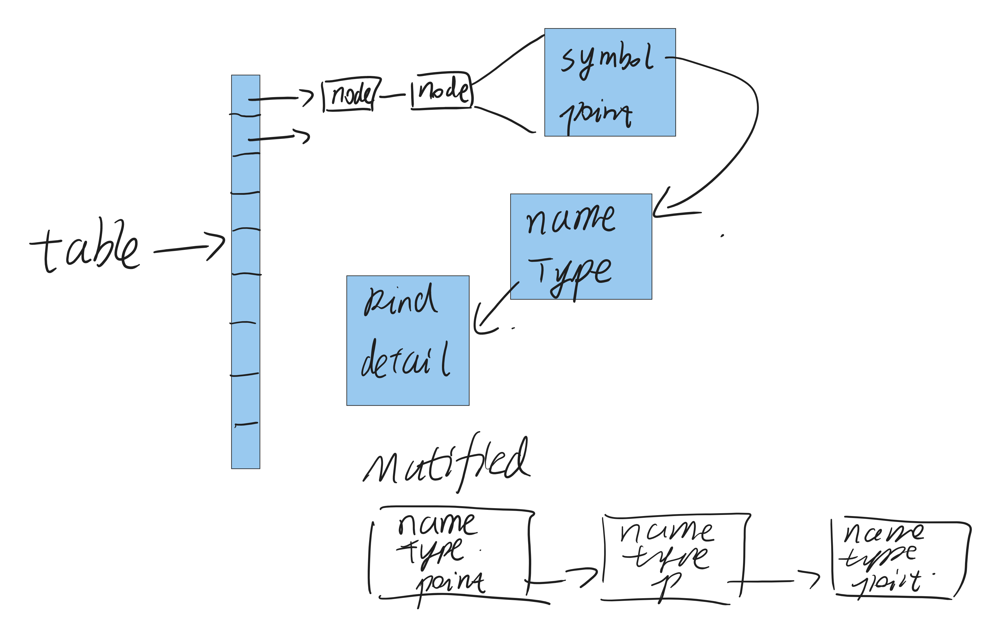
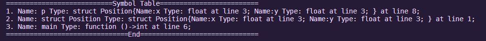
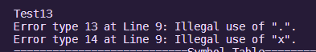

&nbsp;
&nbsp;
&nbsp;
&nbsp;
<center> <font size = 6> 哈尔滨工业大学计算学部 </font></center>
&nbsp;
&nbsp;
&nbsp;
&nbsp;

<center> <font size = 12> 实验报告 </font></center>

&nbsp;
&nbsp;

<center><font size = 5> 
课程名称：编&nbsp;&nbsp;&nbsp;&nbsp;&nbsp;&nbsp;译&nbsp;&nbsp;&nbsp;&nbsp;&nbsp;&nbsp;原&nbsp;&nbsp;&nbsp;&nbsp;&nbsp;&nbsp;理

课程类型：&nbsp;&nbsp;&nbsp;&nbsp;&nbsp;&nbsp;限&nbsp;&nbsp;&nbsp;&nbsp;&nbsp;&nbsp;&nbsp;&nbsp;&nbsp;&nbsp;&nbsp;&nbsp;&nbsp;选&nbsp;&nbsp;&nbsp;&nbsp;&nbsp;&nbsp;
实验题目：语&nbsp;&nbsp;&nbsp;&nbsp;&nbsp;&nbsp;义&nbsp;&nbsp;&nbsp;&nbsp;&nbsp;&nbsp;分&nbsp;&nbsp;&nbsp;&nbsp;&nbsp;&nbsp;析
</font> </center>

<center> <font size = 5> 学号：1190201019 </font></center>
<center> <font size = 5> 姓名：罗家乐 </font></center>

<div STYLE="page-break-after: always;"></div>

# 一、 功能及实现

实验二在实验一的基础上，实现了语法树的解析，符号表的构建，与实验要求的语义错误提示。

## 语法树解析

按照先序遍历法，对实验一中生成的语法生成树进行先序遍历。其中，对于不同非终结符调用不同函数，以进行不同类型的处理。

## 符号表构建

要进行后续的语义检查与及可能的中间代码生成，还需要收集代码中定义的结构、变量，以及函数的参数和返回值，为此，符号表的构建是必须的。

使用如下的数据结构对解析出的符号信息进行存储。
<p align="center"></p>

生成的符号表如下。
<p align="center"></p>

## 语义错误提示

借由在解析语义的过程中参照已生成的符号表，即可进行重复定义、缺少定义、类型不匹配等语义错误的提示。

语义提示示例：
<p align="center"></p>

# 二、 编译、使用及测试方式

本次实验文件提供两种测试方式：

## 手工测试

使用文件附带的makefile，通过make指令，获取最终程序parser。再使用测试用例，逐一测试。

```c
make
./parser test/test1.c //test1.c test2.c test3.c …… test17.c
```

## shell脚本自动测试

使用编写好的Test.sh脚本自动进行测试。

```shell
./Test.sh
```

Test脚本将自动编译源文件生成parser，执行17个测试用例，然后make clean消除生成的文件。

parser将输出语义提示错误以及生成的符号表。