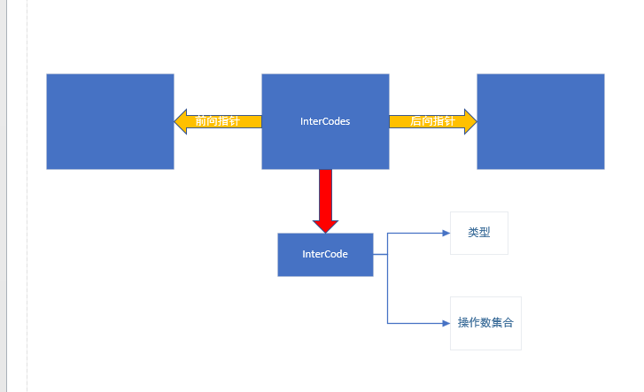

&nbsp;
&nbsp;
&nbsp;
&nbsp;
<center> <font size = 6> 哈尔滨工业大学计算学部 </font></center>
&nbsp;
&nbsp;
&nbsp;
&nbsp;

<center> <font size = 12> 实验报告 </font></center>

&nbsp;
&nbsp;

<center><font size = 5> 
课程名称：编&nbsp;&nbsp;&nbsp;&nbsp;&nbsp;&nbsp;译&nbsp;&nbsp;&nbsp;&nbsp;&nbsp;&nbsp;原&nbsp;&nbsp;&nbsp;&nbsp;&nbsp;&nbsp;理

课程类型：&nbsp;&nbsp;&nbsp;&nbsp;&nbsp;&nbsp;限&nbsp;&nbsp;&nbsp;&nbsp;&nbsp;&nbsp;&nbsp;&nbsp;&nbsp;&nbsp;&nbsp;&nbsp;&nbsp;选&nbsp;&nbsp;&nbsp;&nbsp;&nbsp;&nbsp;
实验题目：中&nbsp;&nbsp;间&nbsp;&nbsp;代&nbsp;&nbsp;码&nbsp;&nbsp;生&nbsp;&nbsp;成
</font> </center>

<center> <font size = 5> 学号：1190201019 </font></center>
<center> <font size = 5> 姓名：罗家乐 </font></center>

<div STYLE="page-break-after: always;"></div>

# 一、 功能及实现

实验三在实验二的基础上，基于语义分析步骤保证的语义正确性，以及生成的符号表，将原始C--代码转换为实验指定的输出格式。

## 语法树解析

在我的实现中，将中间代码生成步骤与语义解析步骤分离，以加强代码的模块化，便于代码编写与维护。

同实验二一样，为生成中间代码，我们还需要对实验一中的语法树进行一次遍历。

按照先序遍历法，对实验一中生成的语法生成树进行先序遍历。其中，对于不同非终结符调用不同函数，以进行不同类型的处理。

## 中间代码生成

为组织生成的中间代码，使用链表来对中间代码进行管理。

<p align="center"></p>

每段InterCodes除了前后向指针，还含有中间代码的承载实体——InterCode，包含操作类型和相关操作数，这样按照特定打印格式即可输出符合规范的中间代码


## 代码优化

按照指导书编写的朴素程序，在生成中间代码时会出现冗余的临时变量声明，使得生成的中间代码冗长且执行效率低下（执行的指令数较多）。

### 消除冗余中间变量——常量/变量

注意到在源码中出现

```c
a = 1
```

时会翻译为

```c
t1 = #1
v1 = t1
```

为处理明显的冗余，在Exp处理INT ID类型时，不生成临时变量，而直接修改操作数。

修改后生成的代码为

```c
v1 = #1
```

更加简洁。

### 消除冗余中间变量——函数调用

同上，将函数调用进行优化

```c
a = func() => t1 = CALL func
              v1 = t1
```

优化后

```c
v1 = CALL func
```


# 二、 编译、使用及测试方式

本次实验文件提供两种测试方式：

## 手工测试

使用文件附带的makefile，通过make指令，获取最终程序parser。再使用测试用例，逐一测试。

```c
make
./parser test/test1.c //test/test2.c等等
```

## shell脚本自动测试

使用编写好的Test.sh脚本自动进行测试。

```shell
./Test.sh
```

Test脚本将自动编译源文件生成parser，执行2个测试用例，将生成的代码导入到test文件夹下的code1.ir等文件中，然后make clean消除生成的文件。

可将test文件夹内的文件使用小程序进行执行。